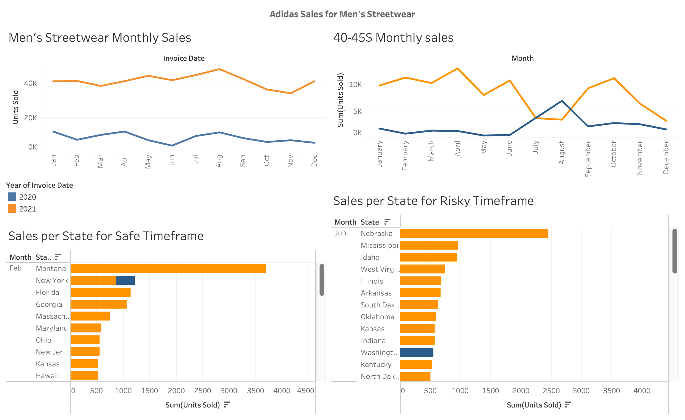

# 🏷️ Adidas Sales Analysis (2020–2021) – Product Launch Strategy

## 📌 Project Overview
This project analyzes Adidas sales data from 2020 and 2021 to determine the best time and place to **launch a new men’s streetwear product** priced between **$40–$45**. 

By analyzing historical sales trends, we identify:
- High-performing **months** and **states** for sales
- Product category performance by **price range**
- **Safe vs risky** launch strategies

## 🎯 Objective
Adidas plans to launch a new **Men's Street Footwear** line priced around **$40–$45**. This project aims to:
- Identify the most suitable **advertising and launch months**
- Provide **regional breakdowns** for demand planning

---

## 🛠 Tools Used
- **SQL** – Data filtering and transformation
- **Tableau** – Visualization and dashboard creation
- **Excel** – Pivot table exploration

---

## 🔍 Methodology

### 1. **Data Filtering**
- Isolated entries for *Men's Street Footwear*
- Filtered products within a **$40–$45** price range
- Extracted and grouped **monthly sales data**

### 2. **Segmentation by Year and Month**
- Compared **monthly units sold** for 2020 and 2021
- Identified trends using line plots for clarity

### 3. **Price Range Filtering**
- Focused analysis on units sold within **$40–$45** range to match new product pricing

### 4. **Timeframe Analysis**
- Evaluated two potential strategies:
  - **Safe Option**: Advertise in **December–January**, launch in **February–March**
  - **Risky Option**: Advertise in **June–July**, launch in **September**

### 5. **State-wise Segmentation**
- Analyzed top-performing states for selected months to guide **inventory allocation**

---

## 📊 Dashboard Insights

### 📈 Key Observations:
- **Sales peak in June–August 2021**, but this trend is not mirrored in 2020 (risk factor).
- **February–March shows stable sales** in both years — ideal for safe launch.
- **Top states** differ for each timeframe — valuable for regional marketing focus.

---

## 🎯 Strategic Recommendations

| Option       | Advertising Period | Launch Period | Reasoning |
|--------------|--------------------|----------------|------------|
| ✅ Safe       | Dec–Jan            | Feb–Mar        | Consistent sales, minimal fluctuation |
| ⚠️ Risky      | Jun–Jul            | Sep            | Strong 2021 trend but unreliable in 2020 |

---

---

## 🚀 Outcome
This analysis provides Adidas with a **data-backed launch playbook** by leveraging historical sales trends. The project showcases full-cycle analytics using SQL, Tableau, and business reasoning.

---

## 📬 Contact
Feel free to connect for feedback or discussion!

